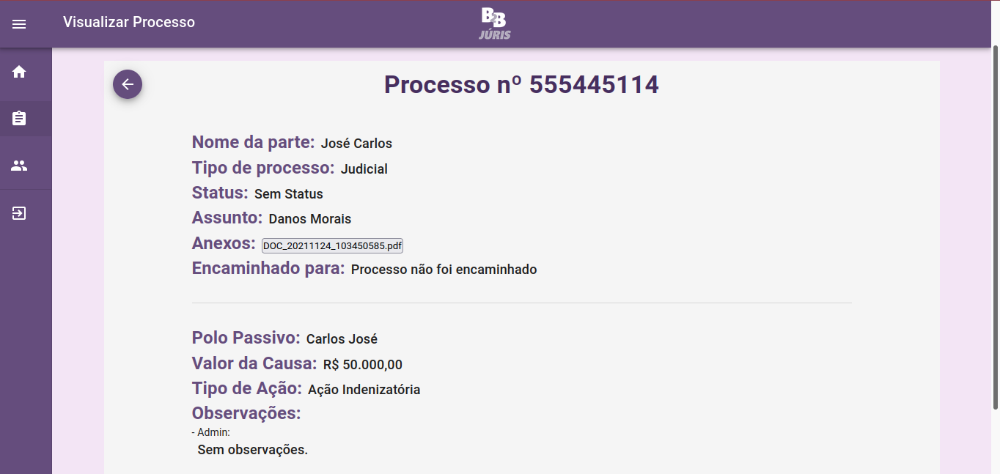

# B2B Juris - Frontend

## Sobre o Projeto

O sistema web B2B Juris foi desenvolvido com a finalidade de auxiliar na
movimentação de processos jurídicos de uma procuradoria na cidade de Timon-MA.

O projeto atual é um cliente web onde os usuários credendiados poderão interagir
com o sistema.

## Tecnologias e Estrutura
O projeto foi escrito utilizando as seguintes tecnologias:

* Linguagem: [Typescript](https://www.typescriptlang.org/)
* Biblioteca: [ReactJS](https://pt-br.reactjs.org/)
  (inicializado com o [Create React App](https://create-react-app.dev/))
* Biblioteca de Componentes: [Material-UI v4](https://v4.mui.com/pt/)

O projeto foi escrito utilizando o padrão de hooks do react (React Hooks)
utilizando componentes funcionais. Dentre as pastas do projeto, se destacam:

* src: Pasta principal que contém todos os arquivos importantes do projeto.
* src/components: Pasta onde se localizam componentes reutilizáveis.
* src/contexts: Pasta que contém algumas APIs de contexto.
* src/pages: Pasta que contém as páginas do sistema, definidas no arquivo
  routes.tsx.
* src/services: Pasta que contém os providers utilizados no sistema.
* src/typescript: Pasta que contém as tipagens e interfaces utilizadas pelo
  typescript.
* src/utils: Pasta que contém funções utilitárias.

## Como executar o projeto
### Desenvolvimento
1. Instalar as dependências.
```bash
$ npm i

$ yarn
```

2. Copiar o arquivo .env.example nomeando como .env e setar as variáveis de
   ambiente necessárias.

3. Iniciar o projeto
```bash
$ npm run start

$ yarn start
```

4. Após isso o projeto estará pronto para ser utilizado em desenvolvimento.

### Produção
1. Instalar as dependências.
```bash
$ npm i

$ yarn
```

2. Copiar o arquivo .env.example nomeando como .env e setar as variáveis de
   ambiente necessárias.

3. Gerar a build de produção
```bash
$ npm run build

$ yarn build
```

4. Iniciar o conteúdo da pasta gerada `build` utilizando algum servidor web.

5. Após isso o projeto estará pronto para ser utilizado em produção.





